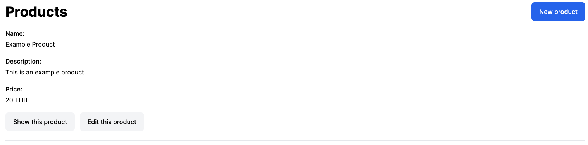
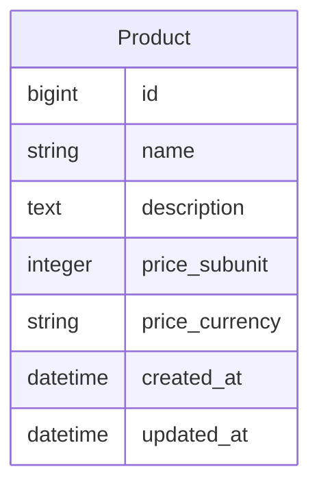

# Spellbook Rails Test

Hey :wave: Welcome to Spellbook's Rails Test - v1. The goal of this exercise is to determine your level of understanding of Ruby on Rails at a basic level. This test is intended for junior and mid-level developers with optional bonus objectives for the more adept.

## The App

The web application that you will need to build should take less than 2 hours to build without additional research and learning time.

## Objectives

1. Setup your own Rails project. Please use the latest versions of both Ruby and Ruby on Rails.
    1. Add Tailwind to the project.
2. Create an Admin interface for data entry.
    1. We are managing a single resource in this app; Products.
3. Create a user-facing pages for listing and showing product details.
4. Create a RESTful API for products.

## What we're looking for

We want to see that you can create a clean and maintainable Ruby on Rails codebase that consists of admin pages for data entry, user-facing pages for visual content consumption and lastly API endpoints for mobile and modern frontend clients. Attention to detail is something we value for our take-home tests. :wink:

## Specs

The Product model should have the following attributes:



Your controller file structure should look like this:

```
.
└── controllers
    ├── admin
    │   ├── application_controller.rb
    │   └── products_controller.rb
    ├── api
    │   ├── v1
    │   │   ├── application_controller.rb
    │   │   └── products_controller.rb
    │   └── application_controller.rb
    ├── application_controller.rb
    └── products_controller.rb
```

Your routes should look like:

```
            Prefix Verb   URI Pattern                        Controller#Action
    admin_products GET    /admin/products(.:format)          admin/products#index
                   POST   /admin/products(.:format)          admin/products#create
 new_admin_product GET    /admin/products/new(.:format)      admin/products#new
edit_admin_product GET    /admin/products/:id/edit(.:format) admin/products#edit
     admin_product GET    /admin/products/:id(.:format)      admin/products#show
                   PATCH  /admin/products/:id(.:format)      admin/products#update
                   PUT    /admin/products/:id(.:format)      admin/products#update
                   DELETE /admin/products/:id(.:format)      admin/products#destroy
   api_v1_products GET    /api/v1/products(.:format)         api/v1/products#index
    api_v1_product GET    /api/v1/products/:id(.:format)     api/v1/products#show
          products GET    /products(.:format)                products#index
           product GET    /products/:id(.:format)            products#show
              root GET    /                                  products#index
```

You can display these by running `rails routes -g products`.

The example app can be found here: https://rails-interview.spellbook.tech/

## Submission

Once you are complete with the tasks above, please push your code to your public GitHub profile and send us the link! We'll have a look and get back to you as soon as we can!

---

## Bonus Objectives

Here are a few tasks that should push you a lot more. Please do not attempt these if the basic objectives took you more than 3 hours. :sweat_smile:

1. Add the `money-rails` gem to the app.
2. Add user authentication to the app.
    1. Admin routes should require a user with an admin flag enabled.
    2. API routes should require a JWT token.
3. Add an `/app/services` directory and create a service object for creating Products.
    1. In this service, add a mailer that sends an email to the authenticated admin that created the product with some of the product details.
4. Add React using Vite for the user-facing page.
